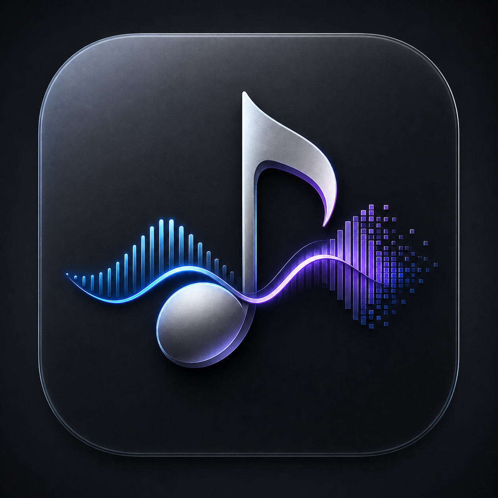

<div align="center">
  

  # RubaTone AI Local

  **Create AI vocal covers on your own PC and control the workflow from Android over your local network.**

  [繁體中文](README.md) · [English](README.en.md) · [简体中文](README.zh-CN.md)

  [](https://github.com/Hiruynk/RubaTone-AI-Local/releases/tag/v1.0.3)
  
  
  
  

  [Download Windows Launcher](https://huggingface.co/hiruynk/RubaTone-AI-Local/resolve/main/RubaTone-AI-Local-Launcher-Setup.exe)
  ·
  [Download Android APK](https://huggingface.co/hiruynk/RubaTone-AI-Local/resolve/main/RubaTone-AI-Local-1.0.2-arm64-release.apk)
  ·
  [All release files](https://huggingface.co/hiruynk/RubaTone-AI-Local/tree/main)
</div>

---

## Overview

RubaTone AI Local is the local Windows edition of RubaTone AI. Your PC stores and processes songs, models, jobs, and outputs. After the first complete installation, the main application works without an Internet connection. The Android app provides the complete remote-control frontend after it is paired with a PC on the same private network.

This GitHub repository is the **source-free official release portal**. Large installers, the APK, runtime volumes, signed manifests, and checksums are hosted on Hugging Face.

## Highlights

| | Capability |
|---|---|
| 🎙️ | Lead vocal, harmony, instrumental, and reverb separation with duet analysis |
| 🎛️ | RVC model import, validation, inference, training, and training continuation |
| 🎚️ | Balanced mix, pitch shift, professional mix, and batch processing |
| ✨ | AudioSR high-frequency restoration and Resemble Enhance vocal refinement |
| 📊 | Vocal-range analysis, anomaly detection, and training-set recommendations |
| 🧭 | Progress, pause, resume, cancel, retry, and background execution |
| 📱 | Android LAN control, real-time event synchronization, and output downloads |
| 🔒 | Local data, device pairing, signed manifests, and per-file integrity checks |

## Architecture

```text
Android app
    │  Private LAN · four-digit pairing · encrypted device connection
    ▼
Windows desktop application
    │
    ├── Core: database, files, job queue, and synchronization
    ├── Separation: UVR / Roformer / Demucs
    ├── RVC: inference, RMVPE, analysis, and training
    ├── AudioSR
    ├── Resemble Enhance
    └── FFmpeg / FFprobe
```

Each AI runtime uses an isolated environment so Python, Torch, CUDA, and NumPy dependencies do not conflict. A central coordinator manages GPU work to reduce failures caused by competing VRAM workloads.

## Requirements

### Windows

| Item | Initial support |
|---|---|
| Operating system | Windows 11 x64 |
| GPU | NVIDIA GeForce RTX 40 / 50 series |
| VRAM | At least 12 GB |
| Network | Internet for first installation and update checks; offline main application after installation |
| Verified hardware | RTX 5070 Ti 16 GB with NVIDIA driver 596.36 |

Other RTX 40 / 50 models are part of the released target range but have not all been validated on physical hardware. RTX 10 / 20 / 30 series GPUs are not part of the initial support range.

### Android

| Item | Requirement |
|---|---|
| OS | Android 10 or later |
| Architecture | arm64 |
| Usage | A reachable RubaTone AI Local PC on the same private network |
| Disconnected state | Only the home page is available |

The APK is published, but the physical Android device matrix has not yet been validated.

## Quick start

### 1. Install on Windows

1. Download and run the [RubaTone AI Local Launcher installer](https://huggingface.co/hiruynk/RubaTone-AI-Local/resolve/main/RubaTone-AI-Local-Launcher-Setup.exe).
2. Start with the safe default location, or customize it if needed. The Launcher detects the GPU and recommends a compatible variant automatically.
3. Download the complete runtime. The Launcher verifies manifests, volumes, and every reconstructed file.
4. Start RubaTone AI Local after verification completes.

The Launcher supports pause, resume, repair, move, optional updates, and rollback after a failed update. If a complete version is already installed, it can be launched without Internet access.

### 2. Pair Android

1. Install the [Android arm64 APK](https://huggingface.co/hiruynk/RubaTone-AI-Local/resolve/main/RubaTone-AI-Local-1.0.2-arm64-release.apk).
2. Connect the phone and PC to the same private network.
3. Display the four-digit pairing code on the PC.
4. Select the PC on Android and enter the code.
5. Confirm the phone name and device fingerprint on the PC.

After pairing, the phone reconnects with a revocable device key. When closing the desktop window, you can keep the service running in the background so Android remains connected.

## Data and privacy

- Every new installation starts with an empty workspace.
- Cloud-account songs, models, training data, outputs, history, preferences, and databases are never imported.
- Songs, models, jobs, and outputs remain on the PC.
- Android does not keep a full music library or model copy. Only explicitly downloaded outputs are written to Android Downloads.
- LAN service is restricted to Windows private networks and is not exposed to the public WAN.
- The Local edition has no login, account switching, or account quota.

## Local versus cloud

| Capability | Local | Cloud |
|---|:---:|:---:|
| Local AI processing | ✅ | — |
| Offline Windows use | ✅ | — |
| Android LAN control | ✅ | — |
| Account and cloud assets | — | ✅ |
| Convert MIDI / MuScriptor | — | ✅ |

The cloud edition remains available at [rubatone-ai.hiruynk.com](https://rubatone-ai.hiruynk.com).

## Updates and integrity

- The Launcher can check for updates when opened; every update is optional.
- Release manifests are signed, and clients accept only content verified by the embedded public key.
- Runtime files use content chunks and SHA-256 verification, so only missing or changed data is downloaded.
- A new version is reconstructed and verified in staging before it becomes active.
- The previous working version is preserved and restored if activation fails.

You can also verify published files manually with [`SHA256SUMS.json`](https://huggingface.co/hiruynk/RubaTone-AI-Local/resolve/main/SHA256SUMS.json).

## Release status

| Component | Version | Status |
|---|---:|---|
| Windows Launcher | 1.0.3 | Released |
| RTX 40 / 50 app / runtime | 1.0.2 | Released; RTX 5070 Ti validated |
| Android arm64 APK | 1.0.2 | Released; physical-device matrix pending |

See the [GitHub Release](https://github.com/Hiruynk/RubaTone-AI-Local/releases/tag/v1.0.3) or [Hugging Face file list](https://huggingface.co/hiruynk/RubaTone-AI-Local/tree/main).

## FAQ

<details>
<summary><strong>Do I need Internet after installation?</strong></summary>

No. After the complete GPU runtime has been downloaded, the Windows application works offline. Internet is needed only when you choose to check for or download updates.
</details>

<details>
<summary><strong>Can the Android app run AI models directly?</strong></summary>

No. Android is the remote-control interface. AI inference and data storage remain on the paired Windows PC.
</details>

<details>
<summary><strong>Can Android continue working after I close the Windows window?</strong></summary>

Yes. Choose the option to close the window while keeping RubaTone AI Local running in the background. Jobs, core services, and the phone connection remain active.
</details>

<details>
<summary><strong>Will my cloud songs or models be migrated automatically?</strong></summary>

No. Local and cloud assets are separate. A new Local installation does not scan or import existing account data.
</details>

## Usage scope and third-party components

The current build is provided for private, non-commercial evaluation by the developer and friends. This repository does not publish application source code, and bundled third-party models do not necessarily share one license. Third-party notices, license texts, and required information are included with the installed package.

---

<div align="center">
  <strong>RubaTone AI Local</strong><br>
  Local processing · LAN control · Optional updates
</div>
